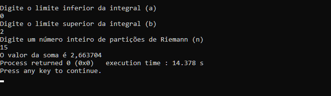
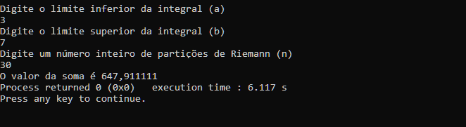
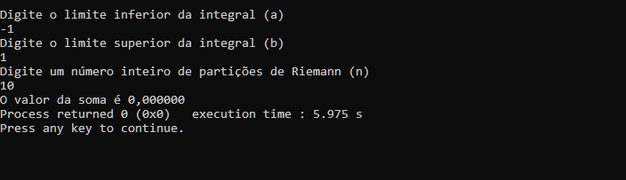
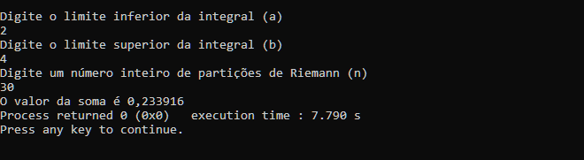
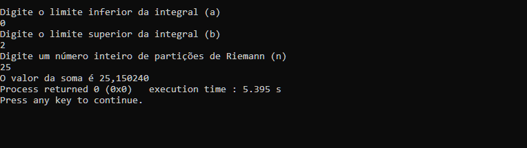
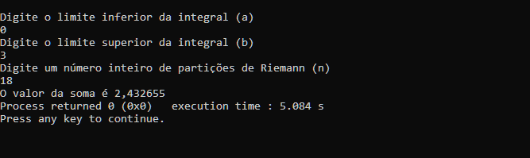

# Soma de Riemann

O seguinte programa em C calcula a Soma de Riemann de determinadas funções elementares com limite inferior (a) e limite superior (b) variável. A precisão do cálculo é baseada no número de partições (n) utilizadas na soma.

## Estrutura geral
Foi utilizado um único arquivo .c com cabeçalho incluso. As bibliotecas utilizadas foram <stdio.h>, <math.h>, <locale.h>.

No código fonte estão presentes três funções principais:
1. "**void clean_buffer**()": Responsável por limpar o buffer de entrada e evitar problemas ao se utilizar o scanf() repetidamente para entradas de texto.
2. "**double somaRiemann(double *Px, double b, int n)**": Responsável por calcular efetivamente a soma dos "retângulos". Declara três parâmetros que serão utilizados na função:
   * O ponteiro ***Px**: Relacionado a variável x (Como o valor se altera ao longo da soma, optei por armazenar como uma variável ponteiro).
   * O limite superior **b**.
   * O número de partições **n**.
3. "**int main()**": Responsável por requisitar os dados de entrada, chamar as duas outras funções e imprimir os textos na tela.

## somaRiemann()

A respeito da soma, os intervalos utilizados como base para o retângulo tiveram a mesma medida: `\frac{b-a}{n}.`

Tal que o ponto amostral utilizado para f(x) foi o do meio do intervalo, pois há uma maior precisão com um número menor de partições **n**.

O somatório `\sum^{n}_{i=1} f(x)\Delta x` foi calculado em um loop while em que o índice aumenta de unidade em unidade (Até que o índice **i** chegue a **n**). Já o ponto amostral passado para f(x) aumenta em `\Delta x`.

A variável **soma** começa em 0 e vai armazenando, ao final de cada loop, o produto entre a base e a altura do retângulo. Ao fim, a função **somaRiemman()** retorna o valor de soma para a função principal **main()**;

## Testes unitários

A seguir estão 6 testes unitários realizados em algumas funções elementares:

* Função `x^2`:
  

* Função ` x^3+4x-3`:
  

* Função `\sin(x)`:
  

* Função `x cos(x^2)`:
  

* Função `3x e^x;`:
  

* Função `\ln (2x)`:
  

## Vídeo
[Vídeo mostrando o funcionamento do programa](https://youtu.be/tML5dzU9PpA)
